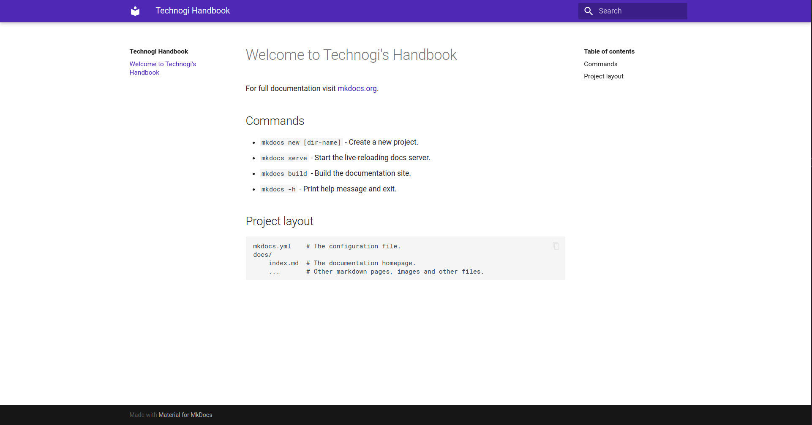

<p align="center">
  <a href="https://github.com/Technogi/handbook">
    
  </a>
</p>

<p align="center" style="font-size: 30px">
  <strong>
    Technogi's Handbook
  </strong>
  <div align="center" style="font-size: 15px">
    Technogi's culture documentation.
  </div>
</p>

---
## Overview

This repository aims to capture the culture that governs Technogi.

---
## Introduction

We chose to use&nbsp;[Markdown] to have a simple framework. ([Review this guide](https://www.markdownguide.org/))

[MkDocs] was used because is a **fast**, **simple** and **downright gorgeous** static site
generator that's geared towards building project documentation. Documentation
source files are written in Markdown, and configured with a single YAML
configuration file. Start by reading the introduction below, then check the [User
Guide](https://www.mkdocs.org/user-guide/writing-your-docs/) for more info.

### Host anywhere

MkDocs builds completely static HTML sites that you can host on GitHub pages,
[Amazon S3], or [anywhere](https://www.mkdocs.org/user-guide/deploying-your-docs/) else you choose.

---
## Installation

### Install with a Package Manager

If you have and use a package manager (such as [apt-get], [dnf], [homebrew],
[yum], [chocolatey], etc.) to install packages on your system, then you may
want to search for a "MkDocs" package and, if a recent version is available,
install it with your package manager (check your system's documentation for
details). That's it, you're done! Skip down to [Getting Started](#getting-started).

If your package manager does not have a recent "MkDocs" package, you can still
use your package manager to install [Python] and [pip]. Then you can use pip to
[install MkDocs](#installing-mkdocs).

[apt-get]: https://help.ubuntu.com/community/AptGet/Howto
[homebrew]: https://brew.sh/
[dnf]: https://dnf.readthedocs.io/en/latest/index.html
[yum]: http://yum.baseurl.org/
[chocolatey]: https://chocolatey.org/

### Manual Installation

In order to manually install MkDocs you'll need [Python] installed on your
system, as well as the Python package manager, [pip]. You can check if you have
these already installed from the command line:

```bash
$ python --version
Python 3.8.2
$ pip --version
pip 20.0.2 from /usr/local/lib/python3.8/site-packages/pip (python 3.8)
```

MkDocs supports Python versions 3.5, 3.6, 3.7, 3.8, and pypy3.

#### Installing Python

Install [Python] by downloading an installer appropriate for your system from
[python.org] and running it.

> **__Note__:**
If you are installing Python on Windows, be sure to check the box to have
Python added to your PATH if the installer offers such an option (it's
normally off by default).

[python.org]: https://www.python.org/downloads/

#### Installing pip

If you're using a recent version of Python, the Python package manager, [pip],
is most likely installed by default. However, you may need to upgrade pip to the
lasted version:

```bash
pip install --upgrade pip
```

If you need to install [pip] for the first time, download [get-pip.py].
Then run the following command to install it:

```bash
python get-pip.py
```

#### Installing all dependencies

The project has other dependencies defined in the 
`requirements.txt` file, to install them we must use pip:

```bash
pip install -r requirements.txt
```

#### Installing MkDocs

Install the `mkdocs` package using pip:

```bash
pip install mkdocs
```

You should now have the `mkdocs` command installed on your system. Run `mkdocs
--version` to check that everything worked okay.

```bash
$ mkdocs --version
mkdocs, version 1.1.2
```

> **__Note__:**
If you are using Windows, some of the above commands may not work
out-of-the-box.
>
>A quick solution may be to preface every Python command with `python -m`
like this:
>
>    python -m pip install mkdocs
    python -m mkdocs
>
>For a more permanent solution, you may need to edit your `PATH` environment
variable to include the `Scripts` directory of your Python installation.
Recent versions of Python include a script to do this for you. Navigate to
your Python installation directory (for example `C:\Python38\`), open the
`Tools`, then `Scripts` folder, and run the `win_add2path.py` file by double
clicking on it. Alternatively, you can download [a2p](https://svn.python.org/projects/python/trunk/Tools/scripts/win_add2path.py) the script and run it
(`python win_add2path.py`).


---
## Getting Started

Getting started is super easy.

There's a single configuration file named `mkdocs.yml`, and a folder named
`docs` that will contain your documentation source files.

MkDocs comes with a built-in dev-server that lets you preview your documentation
as you work on it. Make sure you're in the same directory as the `mkdocs.yml`
configuration file, and then start the server by running the `mkdocs serve`
command:

```bash
$ mkdocs serve
INFO    -  Building documentation... 
INFO    -  Cleaning site directory 
INFO    -  Documentation built in 0.10 seconds 
[I 200525 13:12:42 server:296] Serving on http://127.0.0.1:8000
INFO    -  Serving on http://127.0.0.1:8000
[I 200525 13:12:42 handlers:62] Start watching changes
INFO    -  Start watching changes
[I 200525 13:12:42 handlers:64] Start detecting changes
INFO    -  Start detecting changes
```

Open up `http://localhost:8000/` in your browser, and you'll see the default
home page being displayed:



## Deploying

The documentation site that you just built only uses static files so you'll be
able to host it from pretty much anywhere. [GitHub project pages] and [Amazon
S3] may be good hosting options, depending upon your needs. Upload the contents
of the entire `site` directory to wherever you're hosting your website from and
you're done.

---
## Contributing

Interested in contributing? 
Welcome, check the details in this [guide](CONTRIBUTING.md).

---
## Local Development

Welcome, please read this [guide](DEVELOPMENT.md) in order to setup your local environment.

---
## Code of conduct

Technogi's culture is open, but the contributors to this handbook need to conduct themselves with specific principles. Please read the [code of conduct].


[Amazon S3]: https://docs.aws.amazon.com/AmazonS3/latest/dev/WebsiteHosting.html
[code of conduct]: CODE_OF_CONDUCT.md
[get-pip.py]: https://bootstrap.pypa.io/get-pip.py
[GitHub issues]: https://github.com/Technogi/handbook/issues
[GitHub project pages]: https://help.github.com/articles/creating-project-pages-manually/
[Markdown]: https://daringfireball.net/projects/markdown/
[MkDocs]: https://www.mkdocs.org/
[pip]: https://pip.readthedocs.io/en/stable/installing/
[Python]: https://www.python.org/
